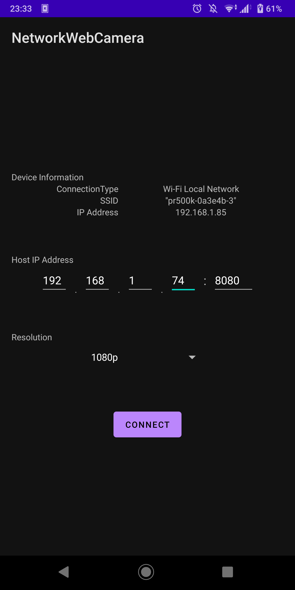
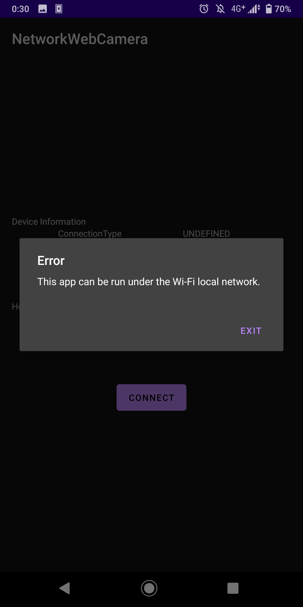

# NetworkWebCamera

Androidスマートフォンのカメラ映像をSocketを通じてリアルタイム送信し，Webカメラのように使える？やつ  
受信にはPCで https://github.com/Nanamiiiii/NetworkWebCameraHost を使用

## 使用方法
PC側アプリケーションを起動しで待機状態にした後，PCのローカルIPアドレスとポートを指定して接続  
接続完了すると自動で送信が始まります．終了はEXITボタンかバックキーで．  
ローカルネットワークでの使用が前提のため，Wi-Fi接続が検出されない場合は終了するようになっています．

## スクリーンショット

## 仕様概要
Camera2 APIを使用して取得した背面カメラ画像をJPEGバイト列に変換  
現状は解像度固定 取得解像度は1920x1080，送信解像度は1280x720  
このバイト列の先頭に情報を付加し，Socketを介して送信  
理論上の最大FPSは60 しかし変換処理等が重いためSDM845でも平均30~40程度と思われる

## 開発

### 環境
- Manjaro Linux (Linux 5.10.42-1)

### 使用ツール/SDK
- Android Studio
- Android SDK (Target API Level 30)
- Gradle

## To Build
Android StudioとAPI Level 30のAndroid SDKが導入されてれば問題ないはず  
Android Virtual Deviceでの動作も確認しているので，実機なしでもテスト可

## テスト端末
- Xperia XZ3 (SO-01L)
    - 体感は普通に動作 スマホ側プレビューは軽いが，PC側は若干の遅延あり(最大1s程度)

- Galaxy A7 (SM-A750C)
    - やや重い スマホの性能不足がボトルネックになりPC側映像にもカクつき・遅延が増加

- Android Virtual Device (Pixel 3a)
    - PCのリソースに依る 挙動に問題はなし